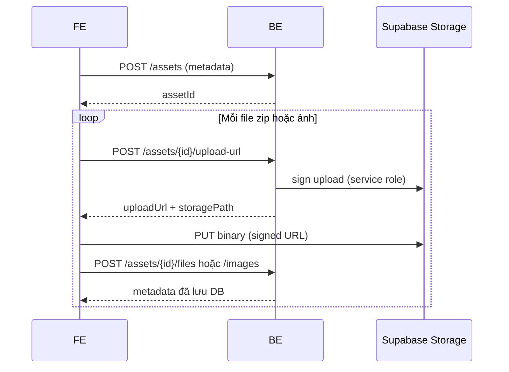
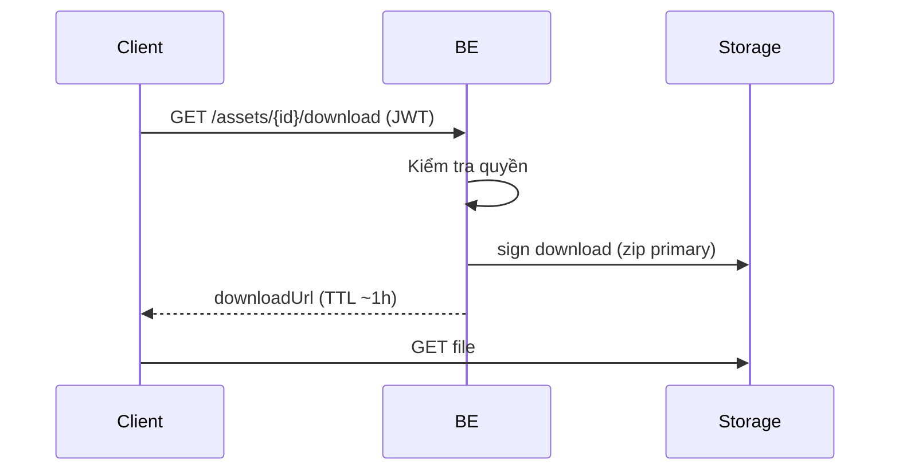

# §4.6 Asset Files & Images (Storage) — Phân tích & triển khai

## 1. Mục tiêu

| Loại | Ví dụ | Ai truy cập | Lưu ở đâu |
|------|--------|-------------|-----------|
| **Gói Unity** | `.zip`, `.unitypackage` | Chỉ người được tải (free / đã mua / owner / admin) | Bucket `asset-files` (private) |
| **Ảnh preview** | thumbnail + gallery 5–15 ảnh | Marketplace (public read) | Bucket `asset-images` (public) |
| **Metadata** | tên file, size, unity version | API + DB | Postgres `asset_files`, `asset_images` |

**Không** lưu binary trong PostgreSQL.

## 2. Luồng upload (AddAsset)



1. Tạo asset (`pending_review`) — §4.5  
2. Xin **signed upload URL** — BE sinh path `{assetId}/{guid}.zip`  
3. FE **PUT** trực tiếp lên Supabase (không qua BE → tiết kiệm băng thông)  
4. FE gọi **register** để BE ghi `asset_files` / `asset_images`  
5. Ảnh `isThumbnail: true` → cập nhật `assets.thumbnail_url` (public URL)

**Điều kiện upload:** chỉ **owner**, asset `draft` hoặc `pending_review`.

## 3. Luồng download (Unity / My Assets)



**Được tải khi:**

- Asset `approved` **và** (`priceType = free` **hoặc** có row `user_assets` **hoặc** admin), **hoặc**
- **Uploader** (kể cả `pending_review` — test gói trước khi duyệt), **hoặc**
- **Admin**

Sau download: `assets.download_count++`; nếu có `user_assets` thì cập nhật `last_download_at`.

## 4. API đã implement

| Method | Endpoint | Mô tả |
|--------|----------|--------|
| POST | `/api/v1/assets/{id}/upload-url` | Body: `kind` (`file`/`image`), `fileName`, `contentType`, `fileSizeBytes` |
| POST | `/api/v1/assets/{id}/files` | Ghi metadata zip sau upload |
| POST | `/api/v1/assets/{id}/images` | Ghi metadata ảnh; `isThumbnail` → `thumbnail_url` |
| GET | `/api/v1/assets/{id}/download` | Signed URL zip primary |

## 5. Cấu hình Supabase Dashboard

1. Tạo buckets: **`asset-files`** (private), **`asset-images`** (public).
2. **Settings → API → service_role** → copy vào `Supabase:ServiceRoleKey` (chỉ BE, không commit).
3. Policy gợi ý:
   - `asset-images`: public SELECT
   - `asset-files`: không public; chỉ signed URL qua service role

## 6. Giới hạn (config `Storage`)

| Key | Mặc định |
|-----|----------|
| `MaxZipBytes` | 2 GB |
| `MaxImageBytes` | 10 MB |
| `MaxImagesPerAsset` | 15 |
| `DownloadUrlExpiresSeconds` | 3600 |

## 7. FE tích hợp (gợi ý)

```typescript
// 1. Upload zip
const { uploadUrl, storagePath } = await api.post(`/assets/${id}/upload-url`, {
  kind: 'file',
  fileName: zip.name,
  contentType: 'application/zip',
  fileSizeBytes: zip.size,
});
await fetch(uploadUrl, { method: 'PUT', body: zip, headers: { 'Content-Type': 'application/zip' } });
await api.post(`/assets/${id}/files`, { storagePath, fileName: zip.name, fileType: 'zip', fileSizeBytes: zip.size, isPrimary: true });

// 2. Nhiều ảnh — lặp kind: 'image', rồi POST /images
```

`GET /assets/{id}` trả `images[].storagePath` dạng **URL public** (gallery).

## 8. Kiến trúc BE

```
AssetStorageController → AssetStorageService → IStorageService (SupabaseStorageService)
                        → IAssetStorageRepository
```
