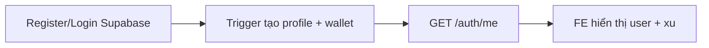
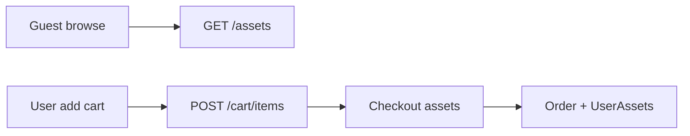
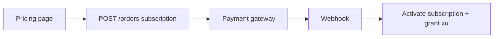
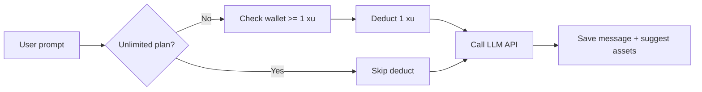

# Plan Backend & REST API — Map từ Frontend

Tài liệu phân tích FE hiện tại (`FE/AssetServiceInterfaceDesign`) và định nghĩa **luồng BE** + **REST API** cần implement.

**Stack đề xuất BE:** ASP.NET Core Web API + EF Core + Supabase PostgreSQL + Supabase Auth (JWT) + Supabase Storage

**Base URL:** `https://api.your-domain.com/api/v1`

**Auth header:** `Authorization: Bearer <supabase_jwt>`

---

## 1. Phân tích Frontend hiện tại

### 1.1 Trang & chức năng

| Route FE | Component | Auth | Mô tả hiện tại (localStorage mock) |
|----------|-----------|------|-------------------------------------|
| `/` | Home | Public | Landing, CTA → auth/dashboard/marketplace |
| `/auth` | Auth | Public | Login, register, demo accounts |
| `/marketplace` | AssetsMarketplace | Public browse | Search, filter, cart, buy |
| `/dashboard` | Dashboard | Login | AI chat mock, trừ 1 xu/câu, gợi ý asset |
| `/pricing` | Pricing | Public | 4 gói → checkout |
| `/checkout?package=` | Checkout | Login | Mua gói subscription (mock payment) |
| `/checkout-assets` | AssetsCheckout | Login | Thanh toán giỏ hàng asset |
| `/my-assets` | MyAssets | Login | Thư viện asset đã mua + download |
| `/add-asset` | AddAsset | Login | Form upload asset → pending_review |
| `/admin` | AdminDashboard | Admin | Users, assets, orders, packages, charts |
| `/contact` | Contact | Public | Form liên hệ (chưa có BE) |
| `/terms`, `/privacy` | Static | Public | Không cần API |

### 1.2 Dữ liệu FE đang mock (cần thay bằng API)

| FE localStorage | Bảng Supabase | Module BE |
|-----------------|---------------|-----------|
| `users`, `currentUser` | profiles + auth.users | Auth, Profiles |
| `cart_{userId}` | cart_items | Cart |
| `purchased_assets_{userId}` | user_assets | User Assets |
| `chat_history_{userId}` | ai_sessions + ai_messages | AI |
| `asset_submissions` | assets (pending_review) | Assets |
| `admin_orders` | orders + order_items | Orders |
| `admin_packages` | subscription_plans + aggregate | Billing |

### 1.3 Role & gói (map DB)

| FE | DB |
|----|-----|
| `role: customer \| admin` | `profiles.role` |
| `subscription: free \| student \| indie \| pro` | `subscriptions` + `subscription_plans.slug` |
| `credits: number` (-1 = unlimited) | `wallets.balance` + plan `is_unlimited` |
| `credits -= 1` per AI message | `wallet_transactions` type `AI_USAGE` |

---

## 2. Kiến trúc BE đề xuất

```text
FE (React)
    │  HTTPS + JWT (Supabase Auth)
    ▼
API Gateway (ASP.NET Core)
    ├── Auth Middleware (validate JWT, load Profile)
    ├── Controllers (REST v1)
    ├── Services (business logic)
    └── Data (AppDbContext → Supabase PG)

Supabase
    ├── Auth (login/register/OAuth)
    ├── PostgreSQL (22 bảng)
    └── Storage (avatars, asset-images, asset-files)
```

**Nguyên tắc:**
- **Auth** do Supabase xử lý — BE không lưu password
- BE đọc `sub` từ JWT → map `profiles.id`
- File upload: FE → Supabase Storage signed URL hoặc BE proxy upload
- Payment: webhook MoMo/VNPay → BE cập nhật `payments`, `orders`, `wallets`

---

## 3. Luồng nghiệp vụ cần làm (theo phase)

### Phase 1 — Foundation (bắt buộc trước)



| # | Luồng | Mô tả |
|---|--------|--------|
| 1.1 | **Đăng ký / Đăng nhập** | Supabase Auth → auto profile + wallet 10 xu + subscription free |
| 1.2 | **Lấy thông tin user** | JWT → profile + wallet + subscription active |
| 1.3 | **Lookup data** | Categories, tags, subscription plans (public) |

### Phase 2 — Marketplace



| # | Luồng | Mô tả |
|---|--------|--------|
| 2.1 | **Browse asset** | Guest/user xem asset approved, search, filter |
| 2.2 | **Chi tiết asset** | Gallery, files, tags, reviews |
| 2.3 | **Giỏ hàng** | CRUD cart_items |
| 2.4 | **Mua asset** | Free → user_assets; Paid → order → payment |
| 2.5 | **Thư viện** | GET user_assets, download signed URL |
| 2.6 | **Bookmark / Review** | bookmarks, asset_reviews |

### Phase 3 — Upload & Moderation

| # | Luồng | Mô tả |
|---|--------|--------|
| 3.1 | **Upload asset** | User POST metadata + upload files Storage → status pending_review |
| 3.2 | **Admin duyệt** | approve / reject → asset approved hiện marketplace |
| 3.3 | **Admin quản lý asset** | edit, delete, stats |

### Phase 4 — Subscription & Payment



| # | Luồng | Mô tả |
|---|--------|--------|
| 4.1 | **Xem gói** | GET subscription-plans |
| 4.2 | **Mua gói** | Create order → redirect payment |
| 4.3 | **Webhook** | Confirm payment → subscription active, cộng xu tháng |
| 4.4 | **Lịch sử thanh toán** | GET payments, orders |

### Phase 5 — AI Advisor



| # | Luồng | Mô tả |
|---|--------|--------|
| 5.1 | **Quản lý session** | CRUD ai_sessions |
| 5.2 | **Gửi tin nhắn** | POST message → trừ xu → gọi OpenAI/Claude |
| 5.3 | **Gợi ý asset** | Semantic search DB → ai_message_assets |
| 5.4 | **Export session** | GET session full (GDD structured metadata) |

### Phase 6 — Admin Dashboard

| # | Luồng | Mô tả |
|---|--------|--------|
| 6.1 | **Overview** | Revenue, DAU, AI usage, top assets |
| 6.2 | **User management** | List, ban, edit wallet balance |
| 6.3 | **Order management** | List, update status |
| 6.4 | **Audit log** | Ghi mọi action admin |

---

## 4. REST API Specification

Quy ước:
- **200** OK | **201** Created | **204** No Content
- **400** Bad Request | **401** Unauthorized | **403** Forbidden | **404** Not Found | **409** Conflict
- Pagination: `?page=1&pageSize=20` → response `{ data, page, pageSize, total }`
- Sort: `?sort=createdAt&order=desc`

Legend: 🌐 Public | 🔒 Auth | 👑 Admin

---

### 4.1 Auth & Profile

| Method | Endpoint | Auth | Mô tả | Map FE |
|--------|----------|------|--------|--------|
| POST | `/auth/register` | 🌐 | *(Optional — nên dùng Supabase client trực tiếp)* | Auth register |
| POST | `/auth/login` | 🌐 | *(Optional — Supabase client)* | Auth login |
| GET | `/auth/me` | 🔒 | Profile + wallet + subscription + credits | AuthContext, Root navbar |
| PATCH | `/auth/me` | 🔒 | Update name, avatar_url | Profile settings |
| POST | `/auth/logout` | 🔒 | Client-side Supabase signOut | logout() |

**Response `GET /auth/me` example:**
```json
{
  "id": "uuid",
  "email": "user@fpt.edu.vn",
  "username": "user",
  "name": "Nguyễn Văn A",
  "role": "customer",
  "avatarUrl": null,
  "wallet": { "balance": 85, "isUnlimited": false },
  "subscription": { "plan": "student", "status": "active", "expiredAt": "..." }
}
```

---

### 4.2 Subscription Plans

| Method | Endpoint | Auth | Mô tả | Map FE |
|--------|----------|------|--------|--------|
| GET | `/subscription-plans` | 🌐 | Danh sách 4 gói | Pricing.tsx |
| GET | `/subscription-plans/{id}` | 🌐 | Chi tiết gói | Pricing |

---

### 4.3 Wallet

| Method | Endpoint | Auth | Mô tả | Map FE |
|--------|----------|------|--------|--------|
| GET | `/wallets/me` | 🔒 | Số dư xu hiện tại | Dashboard, navbar |
| GET | `/wallets/me/transactions` | 🔒 | Lịch sử giao dịch xu | Wallet page (future) |
| PATCH | `/wallets/{userId}` | 👑 | Admin chỉnh balance | Admin users tab |

---

### 4.4 Categories & Tags

| Method | Endpoint | Auth | Mô tả | Map FE |
|--------|----------|------|--------|--------|
| GET | `/categories` | 🌐 | 7 danh mục asset | Marketplace filter, AddAsset |
| GET | `/tags` | 🌐 | Tags (?groupId=) | AddAsset, filter |
| GET | `/tag-groups` | 🌐 | 5 nhóm tag + tags con | AddAsset TAG_GROUPS |

---

### 4.5 Assets (Marketplace)

| Method | Endpoint | Auth | Mô tả | Map FE |
|--------|----------|------|--------|--------|
| GET | `/assets` | 🌐 | List approved. Query: `search`, `categoryId`, `priceType`, `tag`, `sort`, `page` | AssetsMarketplace |
| GET | `/assets/{id}` | 🌐 | Chi tiết + files + images + tags + reviews | Asset detail modal |
| GET | `/assets/slug/{slug}` | 🌐 | Chi tiết theo slug | SEO URL |
| POST | `/assets` | 🔒 | Tạo asset (status=pending_review) | AddAsset.tsx |
| PATCH | `/assets/{id}` | 🔒 | Sửa asset của mình (chỉ draft/pending) | AddAsset edit |
| DELETE | `/assets/{id}` | 🔒 | Soft delete asset của mình | — |
| PATCH | `/assets/{id}/approve` | 👑 | Duyệt asset | Admin assets |
| PATCH | `/assets/{id}/reject` | 👑 | Từ chối + lý do | Admin assets |
| GET | `/assets/pending` | 👑 | List chờ duyệt | Admin assets |

**Query `GET /assets` example:**
```
GET /assets?search=pixel&categoryId=uuid&priceType=free&page=1&pageSize=20&sort=downloadCount&order=desc
```

---

### 4.6 Asset Files & Images (Storage)

| Method | Endpoint | Auth | Mô tả | Map FE |
|--------|----------|------|--------|--------|
| POST | `/assets/{id}/upload-url` | 🔒 | Trả signed URL upload zip/image | AddAsset file upload |
| POST | `/assets/{id}/files` | 🔒 | Ghi metadata file sau upload | AddAsset |
| POST | `/assets/{id}/images` | 🔒 | Ghi metadata image | AddAsset thumbnail |
| GET | `/assets/{id}/download` | 🔒 | Signed URL download (check user_assets hoặc free) | MyAssets download |

---

### 4.7 Cart

| Method | Endpoint | Auth | Mô tả | Map FE |
|--------|----------|------|--------|--------|
| GET | `/cart` | 🔒 | Giỏ hàng + asset preview | Marketplace cart |
| POST | `/cart/items` | 🔒 | `{ assetId, quantity }` | addToCart() |
| PATCH | `/cart/items/{id}` | 🔒 | Đổi quantity | — |
| DELETE | `/cart/items/{id}` | 🔒 | Xóa 1 item | removeFromCart() |
| DELETE | `/cart` | 🔒 | Xóa toàn bộ giỏ | sau checkout |

---

### 4.8 Orders

| Method | Endpoint | Auth | Mô tả | Map FE |
|--------|----------|------|--------|--------|
| GET | `/orders` | 🔒 | Đơn của user (?status=) | — |
| GET | `/orders/{id}` | 🔒 | Chi tiết đơn + items | — |
| POST | `/orders/subscription` | 🔒 | `{ planId, paymentMethod }` | Checkout.tsx gói |
| POST | `/orders/assets` | 🔒 | Checkout từ cart | AssetsCheckout.tsx |
| GET | `/orders` | 👑 | Tất cả đơn (?userId, ?status) | Admin orders |
| PATCH | `/orders/{id}/status` | 👑 | completed/cancelled/refunded | Admin orders |

**Body `POST /orders/assets`:**
```json
{
  "paymentMethod": "momo",
  "useSubscriptionFreeAssets": true
}
```

---

### 4.9 Payments

| Method | Endpoint | Auth | Mô tả | Map FE |
|--------|----------|------|--------|--------|
| GET | `/payments` | 🔒 | Lịch sử thanh toán user | — |
| GET | `/payments/{id}` | 🔒 | Chi tiết | — |
| POST | `/payments/webhook/momo` | 🌐* | Webhook MoMo (*verify signature) | — |
| POST | `/payments/webhook/vnpay` | 🌐* | Webhook VNPay | — |

---

### 4.10 User Assets (Thư viện)

| Method | Endpoint | Auth | Mô tả | Map FE |
|--------|----------|------|--------|--------|
| GET | `/user-assets` | 🔒 | Assets đã mua/tải | MyAssets.tsx |
| GET | `/user-assets/{assetId}` | 🔒 | Chi tiết + download link | MyAssets download |
| POST | `/user-assets/{assetId}/download` | 🔒 | Tăng download_count, trả signed URL | handleDownload() |

---

### 4.11 Bookmarks & Reviews

| Method | Endpoint | Auth | Mô tả | Map FE |
|--------|----------|------|--------|--------|
| GET | `/bookmarks` | 🔒 | Asset đã bookmark | — |
| POST | `/bookmarks` | 🔒 | `{ assetId }` | — |
| DELETE | `/bookmarks/{assetId}` | 🔒 | Bỏ bookmark | — |
| GET | `/assets/{id}/reviews` | 🌐 | Reviews của asset | Asset detail |
| POST | `/assets/{id}/reviews` | 🔒 | `{ rating, comment }` | — |
| PATCH | `/reviews/{id}` | 🔒 | Sửa review của mình | — |
| DELETE | `/reviews/{id}` | 🔒 | Xóa review | — |

---

### 4.12 AI Advisor

| Method | Endpoint | Auth | Mô tả | Map FE |
|--------|----------|------|--------|--------|
| GET | `/ai/sessions` | 🔒 | List sessions user | Dashboard sidebar |
| POST | `/ai/sessions` | 🔒 | `{ title? }` | New session |
| GET | `/ai/sessions/{id}` | 🔒 | Session + messages + suggested assets | Dashboard load |
| PATCH | `/ai/sessions/{id}` | 🔒 | Rename, archive | — |
| DELETE | `/ai/sessions/{id}` | 🔒 | Xóa session | Trash button |
| POST | `/ai/sessions/{id}/messages` | 🔒 | Gửi prompt → AI response | Dashboard send |
| GET | `/ai/sessions/{id}/export` | 🔒 | Export GDD JSON/Markdown | Export GDD (future) |

**Body `POST /ai/sessions/{id}/messages`:**
```json
{
  "content": "Tôi muốn làm game platformer 2D..."
}
```

**Response:**
```json
{
  "userMessage": { "id": "...", "content": "...", "xuCharged": 1 },
  "assistantMessage": {
    "id": "...",
    "content": "...",
    "metadata": {
      "gameplayLoop": ["..."],
      "mechanics": ["..."],
      "artStyle": "pixel_art",
      "roadmap": ["prototype", "mvp"]
    },
    "suggestedAssets": [
      { "assetId": "...", "title": "...", "relevanceScore": 0.92 }
    ]
  },
  "walletBalance": 84
}
```

---

### 4.13 Admin

| Method | Endpoint | Auth | Mô tả | Map FE |
|--------|----------|------|--------|--------|
| GET | `/admin/overview` | 👑 | Stats: revenue, users, AI cost, top assets | Admin overview tab |
| GET | `/admin/users` | 👑 | List users (?search, ?role) | Admin users |
| PATCH | `/admin/users/{id}` | 👑 | Ban, role, wallet | Admin edit user |
| GET | `/admin/analytics/revenue` | 👑 | Doanh thu theo ngày | Charts |
| GET | `/admin/analytics/ai-usage` | 👑 | Token/xu theo user | Charts |
| GET | `/admin/audit-logs` | 👑 | Nhật ký hệ thống | — |

---

### 4.14 Subscriptions (user)

| Method | Endpoint | Auth | Mô tả | Map FE |
|--------|----------|------|--------|--------|
| GET | `/subscriptions/me` | 🔒 | Gói hiện tại + lịch sử | Profile |
| POST | `/subscriptions/cancel` | 🔒 | Hủy gói (end of period) | — |

---

## 5. Tổng hợp API theo module

| Module | Số API | Priority |
|--------|--------|----------|
| Auth & Profile | 4 | P0 |
| Subscription Plans | 2 | P0 |
| Wallet | 3 | P0 |
| Categories & Tags | 3 | P0 |
| Assets | 10 | P0 |
| Asset Files/Storage | 4 | P1 |
| Cart | 5 | P1 |
| Orders | 6 | P1 |
| Payments + Webhook | 4 | P1 |
| User Assets | 3 | P1 |
| Bookmarks & Reviews | 7 | P2 |
| AI Advisor | 7 | P1 |
| Admin | 6 | P2 |
| Subscriptions | 2 | P1 |
| **Tổng** | **~66 endpoints** | |

---

## 6. Thứ tự implement đề xuất

```
Sprint 1 (P0 — FE chạy được cơ bản)
  ├── Supabase JWT middleware
  ├── GET /auth/me
  ├── GET /categories, /tags, /tag-groups
  ├── GET /subscription-plans
  ├── GET /assets, GET /assets/{id}
  └── GET /wallets/me

Sprint 2 (Marketplace flow)
  ├── Cart CRUD
  ├── POST /orders/assets
  ├── GET /user-assets
  ├── POST /assets (upload metadata)
  └── Storage signed URLs

Sprint 3 (AI + Billing)
  ├── AI sessions + messages (+ OpenAI integration)
  ├── POST /orders/subscription
  ├── Payment webhook
  └── Wallet deduct/grant logic

Sprint 4 (Admin)
  ├── Asset approve/reject
  ├── Admin users/orders/overview
  └── Audit logs
```

---

## 7. Map FE → API (quick reference)

| FE Action | API cần gọi |
|-----------|-------------|
| Login | Supabase `signInWithPassword` → `GET /auth/me` |
| Register | Supabase `signUp` → `GET /auth/me` |
| Navbar credits | `GET /auth/me` hoặc `GET /wallets/me` |
| Marketplace list | `GET /assets?...` |
| Add to cart | `POST /cart/items` |
| Checkout assets | `POST /orders/assets` |
| Buy subscription | `POST /orders/subscription` |
| AI send message | `POST /ai/sessions/{id}/messages` |
| My library | `GET /user-assets` |
| Upload asset | `POST /assets` + upload storage |
| Admin approve | `PATCH /assets/{id}/approve` |
| Admin users | `GET /admin/users` |

---

## 8. Lưu ý tích hợp FE

1. Thay `AuthContext` localStorage → Supabase Auth + `GET /auth/me`
2. Tạo `src/services/api.ts` — axios/fetch wrapper với JWT
3. Thay `assetStorage.ts` → gọi `/assets` API
4. Thay `mockAssets` → chỉ dùng API (giữ mock làm fallback dev nếu cần)
5. Environment: `VITE_API_URL`, `VITE_SUPABASE_URL`, `VITE_SUPABASE_ANON_KEY`

---

*Tài liệu tham chiếu: [SYSTEM_ANALYSIS.md](./SYSTEM_ANALYSIS.md), BE entities `BE/Models/Entities/`*
