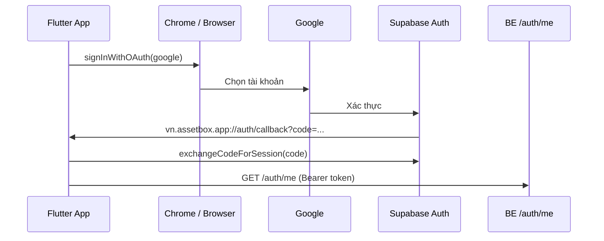

# Google OAuth — Flutter Mobile (Supabase PKCE)

Hướng dẫn cấu hình **đăng nhập Google** cho app Flutter AssetBox, dùng chung Supabase với **Web FE** và **BE**.

> **Không cần SHA-1** cho luồng hiện tại. App dùng **Supabase OAuth qua trình duyệt (PKCE)**, không dùng native `google_sign_in` + `idToken`.

---

## 1. Luồng tổng quan

### Web (FE React) — không đổi

```text
/auth → signInWithOAuth(google)
  → redirectTo: http://localhost:5173/auth/callback
  → AuthCallback.tsx exchange code → BE /auth/me
```

| File | Vai trò |
|------|---------|
| `FE/.../lib/supabase.ts` | Supabase client, PKCE, `detectSessionInUrl: false` |
| `FE/.../contexts/AuthContext.tsx` | `loginWithGoogle()` |
| `FE/.../components/AuthCallback.tsx` | `exchangeCodeForSession` → `completeOAuthSession` |

### Flutter Mobile (Android / iOS) — **mặc định**

```text
/auth → signInWithOAuth(google)
  → redirectTo: vn.assetbox.app://auth/callback   (deep link trực tiếp)
  → Chrome quay lại app ?code=...
  → /auth/callback exchange code → BE /auth/me
```

> Web FE/BE **không cần sửa**. BE chỉ cần khi gọi API (`/auth/config`, `/auth/me`), không cần chạy lúc Supabase redirect.

| File | Vai trò |
|------|---------|
| `Flutter/lib/services/supabase_oauth_service.dart` | OAuth PKCE, mở Chrome |
| `Flutter/lib/screens/auth/auth_callback_screen.dart` | Đổi `code` lấy session |
| `Flutter/lib/providers/service_providers.dart` | `loginWithGoogle`, `completeOAuth` |
| `Flutter/android/.../AndroidManifest.xml` | Intent-filter deep link |

**Tùy chọn (BE bridge):** `--dart-define=OAUTH_REDIRECT_URL=http://10.0.2.2:5180/api/v1/auth/oauth-callback` — dùng `BE/Helpers/MobileOAuthRedirectHtml.cs` nếu deep link không mở app.

### Sơ đồ mobile (mặc định)



---

## 2. Cấu hình Supabase Dashboard

Vào **Supabase** → project → **Authentication** → **URL Configuration**.

### Site URL (dev)

```
http://localhost:5173
```

### Redirect URLs — bắt buộc

Thêm **tất cả** URL sau (mỗi URL một dòng):

| URL | Dùng cho |
|-----|----------|
| `http://localhost:5173/auth/callback` | **Web FE** (bắt buộc nếu web đã chạy) |
| `vn.assetbox.app://auth/callback` | **Flutter mobile** (bắt buộc) |
| `vn.assetbox.app://auth/reset` | Deep link reset MK mobile |
| `http://localhost:5180/api/v1/auth/reset-callback` | Email reset mật khẩu (web) |
| `http://127.0.0.1:42871/auth/callback` | Flutter Windows desktop |
| `http://10.0.2.2:5180/api/v1/auth/oauth-callback` | *(Tùy chọn)* BE bridge Android emulator |
| `http://localhost:5180/api/v1/auth/oauth-callback` | *(Tùy chọn)* BE bridge iOS simulator |

**Thiết bị thật + BE bridge (tùy chọn):** thêm `http://<IP-máy-dev>:5180/api/v1/auth/oauth-callback`

### Google Provider

**Authentication** → **Providers** → **Google** → bật **Enabled**.

- **Client ID** và **Client Secret** lấy từ **Google Cloud Console** → **Web application** OAuth client (không phải Android client).
- Supabase tự thêm redirect URI dạng `https://<project-ref>.supabase.co/auth/v1/callback` — không cần sửa tay.

---

## 3. Google Cloud Console

Vào [Google Cloud Console](https://console.cloud.google.com/) → **APIs & Services** → **Credentials**.

### Cần có

| Loại OAuth Client | Mục đích |
|-------------------|----------|
| **Web application** | Client ID + Secret điền vào Supabase Google provider |
| *(Không bắt buộc)* Android + SHA-1 | Chỉ khi dùng native `google_sign_in` — **project này không dùng** |

### Authorized redirect URIs (Web client)

Phải có URI callback của Supabase:

```
https://<project-ref>.supabase.co/auth/v1/callback
```

Ví dụ project hiện tại:

```
https://xqtngtjfzkxtqpfghdzz.supabase.co/auth/v1/callback
```

### Authorized JavaScript origins (Web client, dev)

```
http://localhost:5173
```

---

## 4. Cấu hình Backend (BE)

File: `BE/appsettings.json` (hoặc `appsettings.Development.json`)

```json
{
  "Supabase": {
    "Url": "https://<project-ref>.supabase.co",
    "AnonKey": "<anon-key>",
    "ServiceRoleKey": "",
    "PasswordResetRedirectUrl": "http://localhost:5180/api/v1/auth/reset-callback",
    "MobileOAuthRedirectUrl": "http://10.0.2.2:5180/api/v1/auth/oauth-callback",
    "FrontendBaseUrl": "http://localhost:5173"
  }
}
```

| Key | Ý nghĩa |
|-----|---------|
| `Url`, `AnonKey` | Flutter gọi `GET /auth/config` lấy cấu hình Supabase public |
| `PasswordResetRedirectUrl` | Supabase gửi email reset → BE → FE `/auth/reset` |
| `MobileOAuthRedirectUrl` | Gợi ý redirect (trả về API); Flutter tự tính từ `API_BASE_URL` |
| `FrontendBaseUrl` | Base URL web cho reset password |

### Endpoint OAuth mobile

| Method | Path | Mô tả |
|--------|------|--------|
| `GET` | `/api/v1/auth/oauth-callback` | Nhận `?code=` từ Supabase → redirect deep link app |
| `GET` | `/api/v1/auth/reset-callback` | Reset email hoặc OAuth `?code=` (legacy) |
| `GET` | `/api/v1/auth/config` | `{ url, anonKey, mobileOAuthRedirectUrl }` |

**Chạy BE:**

```powershell
cd D:\EXE\BE
dotnet run
# → http://localhost:5180
```

---

## 5. Cấu hình Flutter

### API & OAuth redirect

File: `Flutter/lib/config/app_config.dart`

| Nền tảng | `apiBaseUrl` mặc định | `oauthRedirectUrl` mặc định |
|----------|----------------------|----------------------------|
| Android Emulator | `http://10.0.2.2:5180/api/v1` | `vn.assetbox.app://auth/callback` |
| iOS Simulator | `http://localhost:5180/api/v1` | `vn.assetbox.app://auth/callback` |
| Thiết bị thật | `--dart-define=API_BASE_URL=...` | `vn.assetbox.app://auth/callback` (không đổi) |

**Thiết bị thật (cùng Wi‑Fi với máy dev):**

```powershell
cd D:\EXE\Flutter
flutter run --dart-define=API_BASE_URL=http://192.168.1.5:5180/api/v1
```

OAuth redirect vẫn là deep link — **chỉ cần** `vn.assetbox.app://auth/callback` trong Supabase (không cần thêm IP).

**BE bridge (nếu deep link không mở app):**

```powershell
flutter run --dart-define=OAUTH_REDIRECT_URL=http://10.0.2.2:5180/api/v1/auth/oauth-callback
```

→ Thêm URL tương ứng vào Supabase Redirect URLs.

### Deep link Android

File: `Flutter/android/app/src/main/AndroidManifest.xml`

- Scheme: `vn.assetbox.app`
- Host: `auth`
- Path: `/callback`, `/reset`
- `usesCleartextTraffic="true"` (dev HTTP)

Package name: `vn.assetbox.assetbox_mobile`

### iOS (khi build)

Thêm URL scheme `vn.assetbox.app` trong `Info.plist` (CFBundleURLTypes).

---

## 6. Cấu hình Web FE (tham chiếu — không sửa cho mobile)

| File | Google login |
|------|--------------|
| `FE/.../lib/supabase.ts` | PKCE, `detectSessionInUrl: false`, storage `exe_supabase_auth` |
| `FE/.../contexts/AuthContext.tsx` | `redirectTo: ${origin}/auth/callback` |
| `FE/.../components/AuthCallback.tsx` | Exchange code, gọi BE |

Web và mobile **dùng chung** Supabase project và Google Web OAuth client. Không conflict.

---

## 7. Chạy & test

```powershell
# Terminal 1 — BE + Web
cd D:\EXE
npm run dev

# Terminal 2 — Flutter (Android emulator)
cd D:\EXE\Flutter
flutter pub get
flutter run
```

### Checklist test Google login mobile

- [ ] BE chạy tại `:5180`
- [ ] Supabase Redirect URLs đủ (mục 2)
- [ ] Google provider bật trên Supabase
- [ ] Google Cloud Web client có Supabase callback URI
- [ ] Emulator vào màn hình Home trước khi test
- [ ] Bấm **Tiếp tục với Google** → chọn account → app tự quay lại → vào Home

---

## 8. Lỗi thường gặp

| Triệu chứng | Nguyên nhân | Cách xử lý |
|-------------|-------------|------------|
| `redirect_uri_mismatch` | Thiếu `vn.assetbox.app://auth/callback` trong Supabase | Thêm deep link vào Redirect URLs |
| Mở Google xong không quay app | Deep link / manifest sai | Kiểm tra `AndroidManifest`; thử BE bridge (mục 5) |
| `PKCE code verifier not found` | Đổi code 2 lần hoặc session cũ | Xóa data app, đăng nhập lại |
| `idToken = null` khi cấu SHA-1 | Nhầm luồng native Sign-In | Project dùng browser OAuth — **không cần SHA-1** |
| API lỗi sau login Google | BE tắt hoặc sai IP | Chạy BE; thiết bị thật dùng IP LAN |
| `otp_expired` / reset fail | Redirect reset sai | Xem `FE_BE_AUTH_TEST.md` mục reset |
| Emulator `offline` | AVD API 37 không ổn định | Dùng AVD API 34 hoặc mở emulator từ Android Studio |

---

## 9. SHA-1 — khi nào cần?

| Luồng | SHA-1 Android |
|-------|---------------|
| **Supabase OAuth browser (hiện tại)** | Không cần |
| Native `google_sign_in` + `idToken` | Cần — tạo OAuth Android client + `gradlew signingReport` |

Nếu sau này chuyển sang native Sign-In:

```powershell
cd D:\EXE\Flutter\android
.\gradlew signingReport
```

- Package: `vn.assetbox.assetbox_mobile`
- Tạo **OAuth 2.0 Client ID** loại **Android** trên Google Cloud
- Dùng **Web client ID** làm `serverClientId`

---

## 10. File liên quan trong repo

```
BE/
  Controllers/V1/AuthController.cs      # oauth-callback, reset-callback, /auth/config
  Helpers/MobileOAuthRedirectHtml.cs    # HTML bridge → deep link
  Configuration/SupabaseOptions.cs
  appsettings.json

FE/AssetServiceInterfaceDesign/src/
  lib/supabase.ts
  app/contexts/AuthContext.tsx
  app/components/AuthCallback.tsx

Flutter/lib/
  config/app_config.dart
  config/auth_deep_links.dart
  services/supabase_oauth_service.dart
  screens/auth/auth_screen.dart
  screens/auth/auth_callback_screen.dart
  providers/service_providers.dart
  app.dart                              # deep link handler
  core/router/app_router.dart
  android/app/src/main/AndroidManifest.xml
```

---

## 11. Tóm tắt nhanh

1. **Supabase:** bật Google + thêm `vn.assetbox.app://auth/callback` (+ URL web nếu dùng FE).
2. **Google Cloud:** Web OAuth client → Supabase callback URI (đã có nếu web chạy OK).
3. **BE:** chạy `:5180` khi test API sau login (không bắt buộc lúc redirect OAuth).
4. **Flutter:** `flutter run` — đảm bảo Supabase có deep link redirect.
5. **Không cần SHA-1** cho luồng Supabase browser OAuth.
