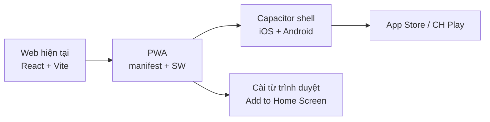
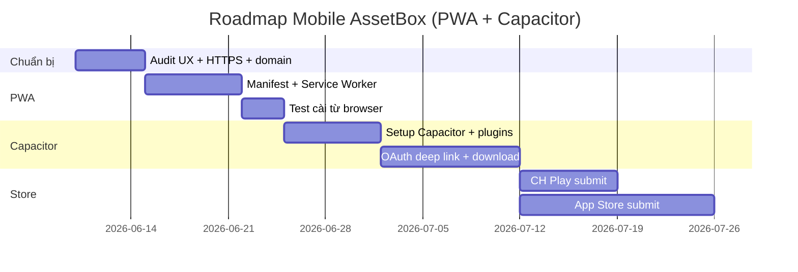
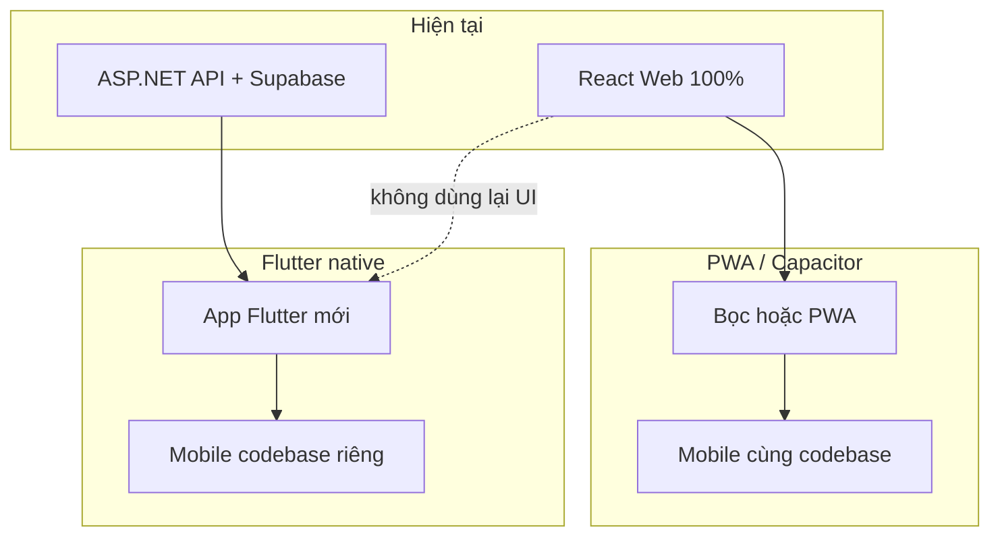

# Plan: Đưa AssetBox (Web) lên Mobile — App cài được trên điện thoại

Tài liệu tổng hợp các hướng triển khai mobile cho nền tảng **AssetBox** (AI Game Asset Marketplace).

---

## 1. Bối cảnh dự án hiện tại

| Thành phần | Công nghệ |
|------------|-----------|
| Frontend | React 18 + TypeScript + Vite + Tailwind CSS 4 + React Router v7 |
| Backend | ASP.NET Core + Supabase (Auth, Storage) |
| Tính năng | Auth, AI Chat, Marketplace, Wallet, Checkout (chuyển khoản), Admin |
| Mobile web | Đã có `MobileBottomNav`, `viewport-fit=cover`, responsive cơ bản |
| PWA / Capacitor / Flutter | **Chưa có** |

**Repo liên quan:** `FE/AssetServiceInterfaceDesign/`

---

## 2. Chọn hướng đi

| Hướng | Cài trên điện thoại | App Store / CH Play | Effort | Phù hợp |
|-------|---------------------|---------------------|--------|---------|
| **PWA** | Có (Add to Home Screen) | CH Play qua TWA; iOS không có store chính thức | Thấp (1–2 tuần) | MVP nhanh |
| **Capacitor** (khuyến nghị) | Có | Có cả 2 store | Trung bình (3–6 tuần) | App “thật” trên store, tái sử dụng web |
| **Flutter native** | Có | Có cả 2 store | Cao (3–6 tháng+) | UX native cao, chấp nhận viết lại |
| **React Native / Expo** | Có | Có cả 2 store | Trung bình-cao | Native, gần stack React hiện tại |
| **Viết lại hoàn toàn** | Có | Có | Rất cao | Không khuyến nghị |

### Khuyến nghị tổng thể

1. **PWA trước** (1–2 tuần) — validate nhu cầu mobile, user cài ngay không cần store.
2. **Capacitor sau** (3–6 tuần) — lên CH Play / App Store với cùng codebase React.
3. **Flutter** chỉ khi coi mobile là sản phẩm chính, có budget 4+ tháng và team Dart/Flutter.



---

## 3. Hướng A: PWA + Capacitor (tái sử dụng web)

### 3.1. Phase 0 — Chuẩn bị (3–5 ngày)

#### Production URL & HTTPS

- App cài được **bắt buộc HTTPS**.
- Chuẩn bị domain production, ví dụ: `https://assetbox.vn`.
- Backend API deploy cùng domain hoặc subdomain có CORS đúng (`VITE_API_BASE_URL`).

#### Audit mobile UX

Code đã có `MobileBottomNav`, `safe-area-inset`, `h-dvh`. Cần rà soát thêm:

| Màn hình | Việc cần làm |
|----------|--------------|
| `/dashboard` (AI Chat) | Sidebar + chat trên màn nhỏ |
| `/admin` | Có thể ẩn trên mobile hoặc giữ read-only |
| Checkout / thanh toán | Form, QR chuyển khoản dễ đọc trên mobile |
| Download asset | Test tải file `.zip` trên Safari iOS & Chrome Android |
| OAuth (Google/Supabase) | Cần deep link — xem mục 3.5 |

#### Phạm vi v1 mobile

- **Bao gồm:** Home, Marketplace, AI Chat, Profile, Wallet, Checkout.
- **Có thể loại v1:** Admin dashboard (hoặc chỉ web).

---

### 3.2. Phase 1 — PWA (1–2 tuần)

**Mục tiêu:** User mở Chrome/Safari → **“Cài đặt ứng dụng” / “Add to Home Screen”**.

#### Web App Manifest

Tạo `public/manifest.webmanifest`:

```json
{
  "name": "AssetBox",
  "short_name": "AssetBox",
  "description": "Nền tảng assets & AI cho game developer",
  "start_url": "/",
  "display": "standalone",
  "background_color": "#0a0e1a",
  "theme_color": "#00d9ff",
  "orientation": "portrait-primary",
  "icons": [
    { "src": "/images/logo-icon-192.png", "sizes": "192x192", "type": "image/png" },
    { "src": "/images/logo-icon-512.png", "sizes": "512x512", "type": "image/png", "purpose": "any maskable" }
  ]
}
```

Cập nhật `index.html`:

- `<link rel="manifest" href="/manifest.webmanifest" />`
- `<meta name="theme-color" content="#00d9ff" />`
- `<meta name="apple-mobile-web-app-capable" content="yes" />`
- Apple touch icon

#### Service Worker

Dùng **`vite-plugin-pwa`**:

```bash
pnpm add -D vite-plugin-pwa
```

- Cache shell app (JS/CSS/fonts).
- **Không cache** API `/api/*`, AI stream, download asset.
- Chiến lược: `NetworkFirst` cho API, `CacheFirst` cho static assets.

#### Kiểm tra

- Chrome DevTools → Lighthouse → PWA score ≥ 90.
- Test trên Android Chrome và iOS Safari.

**Kết quả:** Cài được trên điện thoại qua trình duyệt, chưa cần store.

---

### 3.3. Phase 2 — Capacitor (2–4 tuần)

**Mục tiêu:** File `.apk`/`.aab` (Android) và `.ipa` (iOS) để đăng **CH Play / App Store**.

#### Cài Capacitor

```bash
cd FE/AssetServiceInterfaceDesign
pnpm add @capacitor/core @capacitor/cli
pnpm add @capacitor/android @capacitor/ios
npx cap init "AssetBox" "vn.assetbox.app"
```

Cấu hình `capacitor.config.ts`:

- `webDir: 'dist'`
- `server.url` chỉ dùng khi dev live-reload
- Production: bundle static trong app

#### Build pipeline

```bash
pnpm build          # Vite → dist/
npx cap sync        # Copy vào android/ ios/
npx cap open android
npx cap open ios    # cần macOS + Xcode
```

#### Plugin Capacitor nên dùng

| Plugin | Lý do |
|--------|-------|
| `@capacitor/app` | Deep link, back button Android |
| `@capacitor/browser` | OAuth mở in-app browser |
| `@capacitor/filesystem` + `@capacitor/share` | Download asset game |
| `@capacitor/push-notifications` | Thông báo đơn hàng, hết hạn gói |
| `@capacitor/splash-screen` | Splash khi mở app |
| `@capacitor/status-bar` | Status bar dark theme |

#### Cấu trúc repo đề xuất

```
FE/AssetServiceInterfaceDesign/
├── src/                    # React app (giữ nguyên)
├── public/
├── android/                # Capacitor Android (commit)
├── ios/                    # Capacitor iOS (commit)
├── capacitor.config.ts
└── package.json
```

---

### 3.4. Phase 3 — Xử lý mobile-specific

#### OAuth / Supabase Auth (PKCE)

Hiện tại: `flowType: "pkce"`, callback `/auth/callback` (xem `src/lib/supabase.ts`).

Trên mobile cần:

1. **Deep link / Universal Link:** `assetbox://auth/callback` hoặc `https://assetbox.vn/auth/callback`
2. Cấu hình redirect URL trong Supabase Dashboard.
3. Dùng `@capacitor/browser` hoặc `@capacitor/app` để bắt redirect về app.
4. Test Google OAuth trên cả iOS và Android.

#### Download asset (`.zip`, `.unitypackage`)

WebView mobile thường hạn chế download:

- Dùng Capacitor Filesystem + Share để lưu/mở file.
- Hoặc mở signed URL bằng `@capacitor/browser`.

#### Thanh toán

Flow chuyển khoản hiện tại **ổn trên mobile** (QR + copy STK).

Nếu sau này thêm MoMo/VNPay: cần SDK native hoặc in-app browser + deep link callback.

#### AI Chat streaming

Test kỹ trên WebView iOS (Safari engine) — thường ổn với fetch/SSE.

Nếu lỗi: fallback long-polling hoặc WebSocket.

#### CORS & API

Backend ASP.NET cần cho phép:

- Origin production web
- Capacitor origin: `capacitor://localhost` (iOS), `https://localhost` (Android)

#### Push notifications (tùy chọn v1)

- Firebase Cloud Messaging (Android)
- APNs (iOS)
- BE: endpoint lưu device token, gửi khi order approved / subscription hết hạn

---

### 3.5. Phase 4 — Đăng Store

#### Android (CH Play)

1. Tạo Google Play Developer account (~$25 một lần).
2. Build signed AAB: `./gradlew bundleRelease`.
3. Chuẩn bị: icon 512px, screenshots (phone + tablet), mô tả tiếng Việt/Anh, privacy policy URL.
4. Content rating questionnaire.
5. Review ~1–7 ngày.

**TWA (tùy chọn):** Nếu chỉ PWA, có thể đăng CH Play bằng Trusted Web Activity — nhanh hơn Capacitor nhưng ít tính năng native.

#### iOS (App Store)

1. Apple Developer Program ($99/năm).
2. **Bắt buộc macOS + Xcode** để build & upload.
3. App Review nghiêm: cần privacy policy, mô tả rõ tính năng thanh toán in-app (chuyển khoản ngân hàng thường không bị IAP).
4. TestFlight trước khi public.

#### Tài liệu bắt buộc

- Privacy Policy (đã có `/privacy` — host production).
- Terms of Service.
- Hỗ trợ liên hệ (email/phone).

---

### 3.6. Timeline PWA + Capacitor



| Giai đoạn | Thời gian | Kết quả |
|-----------|-----------|---------|
| PWA only | ~2 tuần | Cài từ browser |
| Capacitor + CH Play | ~4–6 tuần | App Android trên store |
| + App Store | ~6–8 tuần | Cả 2 nền tảng |

---

### 3.7. Checklist kỹ thuật (PWA + Capacitor)

```
□ Tạo icon 192x192, 512x512 (maskable)
□ Thêm vite-plugin-pwa + manifest
□ Test MobileBottomNav + AI dashboard trên iPhone SE / Android nhỏ
□ Cấu hình CORS BE cho capacitor origins
□ Supabase redirect URLs cho mobile deep link
□ Capacitor init trong FE/AssetServiceInterfaceDesign
□ Plugin: App, Browser, Filesystem, Splash, StatusBar
□ CI: build web → cap sync → build AAB
□ Privacy/Terms URL production
□ Tài khoản developer Google + Apple
```

---

## 4. Hướng B: Flutter native

### 4.1. Flutter trong bối cảnh AssetBox

| Cách dùng Flutter | Ý nghĩa | Tái sử dụng code React? |
|-------------------|---------|---------------------------|
| **Flutter native** (khuyến nghị nếu chọn Flutter) | UI, routing, state, API client viết lại bằng Dart | **Không** |
| **Flutter + WebView** | Giống Capacitor nhưng nặng hơn, ít lợi thế | Có (web) — **không nên** |
| **Flutter Web** | Build web bằng Flutter | **Không** — thay React, không phải mobile |

**Kết luận:** Flutter = **viết lại app mobile**, không phải “bọc web”. Backend ASP.NET + Supabase **giữ nguyên**.



---

### 4.2. So sánh Flutter vs PWA / Capacitor

| Tiêu chí | PWA / Capacitor | Flutter native |
|----------|-----------------|----------------|
| Tái sử dụng code FE | ~95–100% | ~0% UI, ~30% logic (API contract) |
| Thời gian | 2–8 tuần | **3–6 tháng+** (team 1–2 dev) |
| UX mobile | Tốt nếu web responsive | **Tốt nhất** (gesture, animation, native feel) |
| Performance | WebView, đủ dùng | Native, mượt hơn |
| Maintain | 1 codebase FE | **2 codebase** (Web React + App Flutter) |
| OAuth Supabase | Deep link + Browser plugin | `supabase_flutter` + deep link |
| AI chat streaming | SSE/fetch trong WebView | `http` / WebSocket Dart |
| Admin dashboard | Dùng chung web | Viết lại hoặc bỏ trên mobile |
| CH Play / App Store | Có (Capacitor) | Có |

---

### 4.3. Kiến trúc Flutter đề xuất

```text
┌─────────────────────────────────────┐
│         Flutter App (Dart)          │
├─────────────────────────────────────┤
│  Presentation                       │
│  ├── screens/ (Home, Market, AI…)   │
│  ├── widgets/ (design system riêng) │
│  └── routing (go_router)            │
├─────────────────────────────────────┤
│  State (Riverpod / Bloc)            │
├─────────────────────────────────────┤
│  Data layer                         │
│  ├── api/ → gọi BE ASP.NET (REST)   │
│  ├── supabase_flutter (auth)        │
│  └── models/ (DTO mirror từ BE)     │
└─────────────────────────────────────┘
              │
              ▼
    ASP.NET API  +  Supabase Auth
    (giữ nguyên — không đổi BE)
```

---

### 4.4. Scope viết lại

| Module | React hiện tại | Flutter — effort |
|--------|----------------|------------------|
| Design system (Kinetic Dark) | Tailwind + theme.css | **Lớn** — `ThemeData`, custom widgets |
| Auth (email + OAuth PKCE) | Supabase JS + AuthCallback | `supabase_flutter` + deep link |
| Home, Marketplace, Asset detail | Nhiều component | Viết lại từng màn |
| AI Dashboard / chat | Sidebar + stream | **Khó** — UI chat + SSE/stream |
| Cart, Checkout, bank transfer | Form + poll order | Viết lại |
| Profile, Wallet, subscription | Tabs, pagination | Viết lại |
| Notifications | NotificationBell | FCM + API |
| Download asset | Web download | `path_provider` + share |
| Admin | AdminDashboard lớn | Thường **bỏ mobile v1** |
| ~50+ UI components (Radix/shadcn) | Có sẵn | Material 3 hoặc custom |

**Ước lượng:** ~40–60 màn hình/widget lớn, hàng trăm API call/types cần port sang Dart.

---

### 4.5. Stack Flutter gợi ý

```yaml
# pubspec.yaml (gợi ý)
dependencies:
  flutter:
  go_router:          # routing
  flutter_riverpod:   # state
  supabase_flutter:   # auth
  dio:                # HTTP client → BE API
  freezed:            # DTO + json_serializable
  cached_network_image:
  flutter_markdown:   # AI response
  url_launcher:
  share_plus:         # share/download
  firebase_messaging: # push (optional)
```

**Design:** Không port Tailwind 1:1 — cần **design tokens Dart** (màu `#00d9ff`, `#a855f7`, font Space Grotesk/Inter) và widget library nội bộ.

---

### 4.6. Timeline Flutter (1 dev)

| Phase | Nội dung | Thời gian |
|-------|----------|-----------|
| 0 | Setup project, theme, routing, API client, auth | 2–3 tuần |
| 1 | Marketplace + asset detail + search/filter | 3–4 tuần |
| 2 | Auth hoàn chỉnh + profile + wallet | 2–3 tuần |
| 3 | AI chat + streaming + sessions | 3–4 tuần |
| 4 | Checkout, orders, notifications | 2–3 tuần |
| 5 | Polish, test, store submit | 2–3 tuần |
| **Tổng** | MVP không admin | **~3–5 tháng** |

Song song với web React → mỗi feature mới phải làm **2 lần** (web + Flutter).

---

### 4.7. Ưu / nhược Flutter

#### Ưu điểm

- UX native: scroll, keyboard, gesture, splash, status bar mượt
- Performance tốt hơn WebView (AI chat dài, list asset lớn)
- Push notification, file system, share “chuẩn” mobile
- Một codebase mobile cho **cả iOS + Android**
- Dễ tách team mobile sau này

#### Nhược điểm

- **Không tái sử dụng** React/Tailwind/Radix đã build
- Chi phí maintain **gấp đôi** (web + mobile)
- Admin, chart (recharts), drag-drop phức tạp → port tốn kém
- Team cần skill Dart/Flutter
- Mọi bug fix UI phải sửa 2 nơi (trừ khi chỉ ship Flutter mobile)

---

### 4.8. Chiến lược Flutter

#### Option A — Flutter thuần (all-in)

- Web React giữ cho desktop/admin
- Mobile chỉ Flutter
- **Phù hợp:** budget 3–6 tháng, ưu tiên app store chất lượng cao lâu dài

#### Option B — Hybrid (thực tế nhất)

1. **Flutter v1:** Auth + Marketplace + Asset detail + Profile (80% traffic)
2. **WebView trong Flutter:** Checkout phức tạp, Admin (ít dùng trên mobile)
3. Dần thay WebView bằng native screen

#### Option C — Không nên

- Flutter app 100% WebView bọc React → tệ hơn Capacitor, không có lý do rõ

---

## 5. So sánh thêm: Flutter vs React Native (Expo)

Vì dự án **đã dùng React**, đáng cân nhắc:

| | Flutter | React Native (Expo) |
|---|---------|---------------------|
| Ngôn ngữ | Dart (mới) | TypeScript (quen) |
| Tái sử dụng logic | API types, business rules | **Hooks, utils, API client** dễ share hơn |
| Tái sử dụng UI | Không | Một phần (khác DOM vs RN) |
| Effort port từ web | Cao | Trung bình-cao |
| Ecosystem | Tốt | Tốt |

Nếu muốn native mà vẫn gần React → **Expo** thường hợp lý hơn Flutter cho team hiện tại.

---

## 6. Bảng quyết định nhanh

| Tình huống | Nên chọn |
|------------|----------|
| Cần app cài được **trong 1–2 tháng**, team chủ yếu React | **PWA → Capacitor** |
| Web đã xong, muốn **ít code nhất** | **Capacitor** |
| Có team Flutter, budget 4+ tháng, UX mobile là **USP** | **Flutter native** |
| Muốn native, giữ ecosystem React/TS | **Expo / React Native** |
| Chỉ cần Android store nhanh, ít native code | **PWA + TWA (CH Play)** |

---

## 7. Chi phí ước tính

| Hạng mục | Chi phí |
|----------|---------|
| Google Play Developer | ~$25 (một lần) |
| Apple Developer | ~$99/năm |
| Hosting (đã có) | Theo plan hiện tại |
| Mac cho build iOS | Thuê Mac cloud ~$30/tháng nếu không có Mac |
| Push (Firebase) | Miễn phí tier cơ bản |

---

## 8. Tóm tắt khuyến nghị

| Mục tiêu | Hướng |
|----------|-------|
| Nhanh nhất, ít code | **PWA** |
| App store + tái sử dụng web | **Capacitor** |
| UX native cao nhất, budget dài | **Flutter** |
| Native + gần React | **Expo** |

**Không nên:** Viết lại hoàn toàn bằng stack mới khi web responsive đã gần xong; Flutter + WebView bọc React (tệ hơn Capacitor).

---

## 9. Bước tiếp theo đề xuất

1. **Tuần 1–2:** Triển khai PWA (manifest, icons, `vite-plugin-pwa`).
2. **Tuần 3–4:** Audit UX mobile trên thiết bị thật (AI chat, checkout, download).
3. **Tuần 5–8:** Capacitor + OAuth deep link + build Android.
4. **Tuần 9–10:** iOS + submit store (nếu có Mac / Apple Developer).

Hoặc nếu chọn Flutter: khởi tạo repo `mobile/` riêng, mirror API DTO từ BE, MVP 4 màn (Auth, Home, Marketplace, Profile).

---

**Cập nhật:** 2026-06-10  
**Flutter scaffold:** 2026-06-12 — xem [FLUTTER_APP.md](./FLUTTER_APP.md), [FLUTTER_BACKLOG.md](./FLUTTER_BACKLOG.md)

**Liên quan:** [SYSTEM_ANALYSIS.md](./SYSTEM_ANALYSIS.md), [BE_API_PLAN.md](./BE_API_PLAN.md), [docs/README.md](./README.md)
