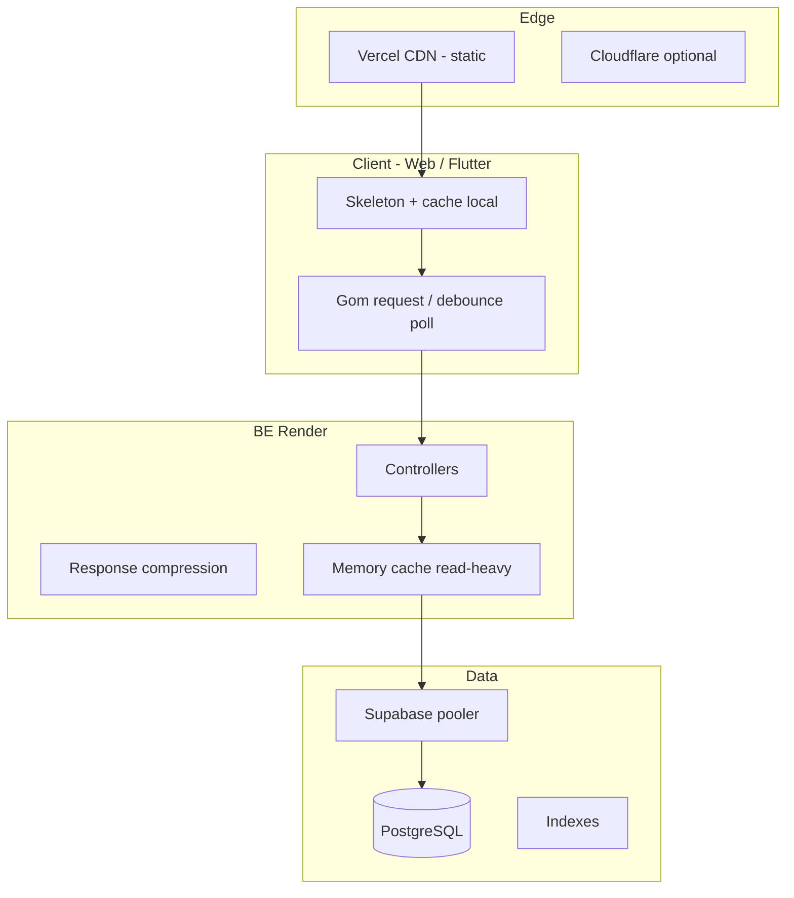

# Plan hiệu năng — AssetBox (~100 user đăng nhập đồng thời)

Tài liệu hướng dẫn **tăng tốc loading, request/response** và chịu tải khoảng **< 100 người online cùng lúc** (web + mobile gọi chung BE).

**Stack hiện tại**

| Thành phần | Hosting | Ghi chú |
|------------|---------|---------|
| Web FE | Vercel | Static + CDN — thường nhanh |
| BE API | Render (Docker) | **Nút thắt chính** nếu dùng free tier |
| Database | Supabase PostgreSQL | Pooler `aws-1-ap-south-1.pooler.supabase.com` |
| Auth | Supabase JWT | BE verify JWKS (đã cache 1h) |
| Mobile | Flutter APK | Gọi cùng API Render |

**Cập nhật:** 2026-06-22

---

## 1. Mục tiêu đo lường được

| Chỉ số | Hiện tại (ước lượng) | Mục tiêu |
|--------|----------------------|----------|
| Cold start BE (Render free) | 20–60s sau idle | **< 3s** (paid / always-on) |
| `GET /api/v1/assets` (marketplace) | 300–800ms+ | **< 200ms** p95 |
| `GET /api/v1/auth/me` | 100–400ms | **< 150ms** p95 |
| `GET /api/v1/subscription-plans` | 100–300ms | **< 50ms** p95 (cache) |
| Trang marketplace FE (TTFB API) | Phụ thuộc BE + số request | **1 request chính**, skeleton < 100ms |
| 100 user concurrent | Chưa test — free tier dễ nghẽn | **p95 < 500ms** API đọc, không 5xx |

**Công cụ đo:** Swagger + browser DevTools Network, [k6](https://k6.io/) hoặc [Bombardier](https://github.com/codesenberg/bombardier) load test BE.

---

## 2. Nút thắt hiện tại (đã rà trong repo)

### 2.1 Hạ tầng

- **Render free:** instance sleep → cold start; 1 CPU/RAM hạn chế; không scale ngang.
- **BE single process:** mọi request (auth, marketplace, AI, admin) dùng chung 1 container.
- **Supabase free/pro:** giới hạn connection + IOPS; pooler bắt buộc khi nhiều kết nối đồng thời.

### 2.2 Backend (`BE/`)

- **Chưa có** `ResponseCompression` (gzip/brotli).
- **Chưa có** `IMemoryCache` / Redis cho dữ liệu đọc nhiều (plans, categories, tags, asset list).
- **Chỉ JWKS** được cache (`SupabaseJwksProvider`, 1h).
- **EF Core:** đa số read đã `AsNoTracking()` — tốt; vẫn có thể N+1 khi `Include` asset + images + tags.
- **HttpClient OpenAI:** timeout 90s — AI chat chiếm thread lâu, ảnh hưởng user khác trên cùng instance.
- **Không health check** tách biệt — Render khó biết app sẵn sàng.

### 2.3 Frontend web (`FE/`)

- **Polling nền** (mỗi user đã login):
  - `NotificationBell`: refresh API **mỗi 30s**
  - `useAdminPendingOrderAlerts`: poll **mỗi 30s** (admin)
  - `MyOrders`: poll khi có đơn pending
  - `Root`: `refreshUserData` khi focus tab
- **100 user** × poll 30s ≈ **3–4 req/s chỉ riêng notifications** + `/auth/me` — nhân thêm các trang load song song.
- **Chưa có** React Query / SWR — ít cache phía client, dễ gọi API trùng.
- **Bundle JS lớn** (~2.5MB build) — first load chậm trên mạng yếu (không ảnh hưởng API sau khi đã load).

### 2.4 Flutter

- Mỗi màn gọi API khi mount — chưa cache aggressive (cached_network_image chỉ ảnh).
- Cold start Render ảnh hưởng rõ trên mobile.

---

## 3. Chiến lược tổng thể



**Thứ tự ưu tiên:** Hạ tầng (bỏ cold start) → Giảm số request FE → Cache BE → Tối ưu DB → Load test.

---

## 4. Phase 0 — Quick wins (1–3 ngày, không đổi host)

### 4.1 Render: giữ instance sống (nếu vẫn free)

- Dùng [UptimeRobot](https://uptimerobot.com/) ping `GET /api/v1/auth/config` mỗi **5–10 phút** — giảm cold start (không thay paid tier).
- **Lưu ý:** vi phạm tinh thần free tier nếu lạm dụng; demo OK, production nên upgrade.

### 4.2 BE — bật nén response

Trong `Program.cs`:

```csharp
builder.Services.AddResponseCompression(options =>
{
    options.EnableForHttps = true;
});
// ...
app.UseResponseCompression(); // trước UseCors
```

Giảm ~60–80% kích thước JSON lớn (marketplace, admin).

### 4.3 BE — cache in-memory cho API đọc nhiều

| Endpoint | TTL gợi ý | Ghi chú |
|----------|------------|---------|
| `GET /subscription-plans` | 5–15 phút | Ít đổi |
| `GET /credit-packs` | 5–15 phút | Ít đổi |
| `GET /lookup/categories` | 10–30 phút | |
| `GET /lookup/tags` | 10–30 phút | |
| `GET /auth/config` | 1 giờ | Public |
| `GET /assets` (list) | 30–60s | Key = query hash; invalidate khi admin duyệt asset |

```csharp
builder.Services.AddMemoryCache();
// Inject IMemoryCache vào service hoặc filter
```

### 4.4 FE — giảm polling

| Hiện tại | Đề xuất |
|----------|---------|
| Notification 30s | **60–120s**, hoặc chỉ khi `document.visibilityState === 'visible'` |
| Admin orders 30s | 60s + chỉ trên trang admin |
| `refreshUserData` on focus | Debounce 5s |
| MyOrders poll | Tăng interval hoặc dừng khi tab ẩn |

→ Với 100 user: giảm **~50%** request nền.

### 4.5 FE — skeleton thay vì chờ full data

- Marketplace, Pricing: đã có spinner — giữ **skeleton grid** (đã có `AssetGridSkeleton` Flutter; web có thể thêm tương tự).
- Perceived performance tốt hơn dù API vẫn 300ms.

### 4.6 Supabase connection string

Đang dùng **transaction pooler** (port 5432 pooler) — đúng cho serverless/EF.

Khi > 50 concurrent connection từ BE:

- Kiểm tra **Supabase Dashboard → Database → Connection pooling**
- Cân nhắc `Maximum Pool Size` trong connection string Npgsql:

```
...;Maximum Pool Size=20;Timeout=15;Command Timeout=30
```

Không set quá cao — pooler Supabase có giới hạn theo plan.

---

## 5. Phase 1 — Nâng hạ tầng (bắt buộc cho 100 user ổn định)

### 5.1 Render — upgrade Web Service

| Gói | RAM | CPU | Always-on | Phù hợp |
|-----|-----|-----|-----------|---------|
| Free | 512MB | shared | Không | Dev/demo |
| **Starter ($7/mo)** | 512MB | shared | **Có** | Demo lớn, ~30–50 user |
| **Standard ($25/mo)** | 2GB | 1 | Có | **~100 user** đọc nặng |
| Pro | 4GB+ | 2+ | Có | AI + admin nhiều |

**Khuyến nghị cho mục tiêu 100 user:** ít nhất **Starter** (bỏ cold start); nếu có AI chat đồng thời → **Standard**.

Env thêm:

```
WEB_CONCURRENCY=1
ASPNETCORE_ENVIRONMENT=Production
```

(.NET 10 single process thường đủ; scale horizontal cần sticky session hoặc stateless — API đã stateless).

### 5.2 Supabase

| Plan | Direct connections | Phù hợp |
|------|-------------------|---------|
| Free | Hạn chế | < 20 concurrent |
| **Pro ($25/mo)** | Cao hơn | **100 user** + connection pooler |

### 5.3 Vercel

- FE static — **Pro không bắt buộc** cho 100 user xem web.
- Bật **Compression** (mặc định có).

### 5.4 (Tuỳ chọn) Redis cache

Khi > 1 instance BE hoặc cache chia sẻ:

- [Upstash Redis](https://upstash.com/) (serverless) hoặc Redis trên Render
- Thay `IMemoryCache` bằng `IDistributedCache` cho plans/categories/assets list

---

## 6. Phase 2 — Tối ưu Backend (1–2 tuần code)

### 6.1 Database indexes

Kiểm tra và thêm index cho query thường xuyên (chạy trên Supabase SQL):

```sql
-- Marketplace list approved
CREATE INDEX IF NOT EXISTS idx_assets_status_created
  ON assets (status, created_at DESC) WHERE deleted_at IS NULL;

CREATE INDEX IF NOT EXISTS idx_assets_category_status
  ON assets (category_id, status) WHERE deleted_at IS NULL;

-- Orders user
CREATE INDEX IF NOT EXISTS idx_orders_user_created
  ON orders (user_id, created_at DESC);

-- Notifications unread
CREATE INDEX IF NOT EXISTS idx_notifications_user_read
  ON notifications (user_id, read_at, created_at DESC);
```

Chạy `EXPLAIN ANALYZE` trên query chậm trong `AssetRepository.ListApprovedAsync`.

### 6.2 Giảm payload API

- `GET /assets`: trả **thumbnail URL** thay vì full image list khi list view.
- Pagination: giữ `pageSize` ≤ 20 mặc định (đã có max 100).
- Bật **HTTP/2** (Render HTTPS mặc định).

### 6.3 Tách AI workload

AI chat gọi OpenAI 5–30s — **block thread pool**:

- **Option A:** `SemaphoreSlim` giới hạn 5 concurrent AI request/instance.
- **Option B (tốt hơn):** Queue + background worker (Hangfire / channel) — trả `202 Accepted` + poll kết quả.
- **Option C:** Rate limit AI theo user (đã có xu/plan).

### 6.4 Health endpoints

```csharp
app.MapGet("/health", () => Results.Ok(new { status = "ok" }));
app.MapGet("/health/ready", async (AppDbContext db) => {
    await db.Database.CanConnectAsync();
    return Results.Ok();
});
```

Render **Health Check Path:** `/health` — restart nhanh khi DB mất kết nối.

### 6.5 Logging & slow query

- Log request > 1s (middleware).
- Supabase → **Query Performance** — bật pg_stat_statements nếu Pro.

---

## 7. Phase 3 — Tối ưu Frontend web (1 tuần)

### 7.1 React Query (TanStack Query)

```bash
npm install @tanstack/react-query
```

- Cache `subscription-plans`, `categories`, `assets` list **staleTime: 60_000**
- `auth/me` staleTime 30s — giảm gọi trùng khi chuyển trang
- Polling notifications → `refetchInterval` chỉ khi tab visible

### 7.2 Code splitting

- `React.lazy()` cho `/admin`, `/dashboard` (AI), checkout
- Giảm first JS payload — Vite `manualChunks` cho MUI/charts

### 7.3 Prefetch

- Hover link marketplace → prefetch asset detail
- Sau login → prefetch `/auth/me` + plans (đã có token)

### 7.4 Ảnh

- Dùng Supabase Storage **transform/resized** URL cho thumbnail
- `loading="lazy"` trên `` (đã có một phần)

---

## 8. Phase 4 — Flutter mobile

- **Dio** connection pool mặc định OK.
- Cache local `shared_preferences` / hive cho plans, categories (TTL 15 phút).
- Retry với exponential backoff khi Render cold start.
- Hiển thị skeleton — đã có `LoadingView`, `AssetGridSkeleton`.

---

## 9. Load test — kịch bản 100 user

### 9.1 Công cụ

```powershell
# Cài k6: https://k6.io/docs/get-started/installation/
# Hoặc bombardier:
go install github.com/codesenberg/bombardier@latest
```

### 9.2 Kịch bản cơ bản

| Bước | Hành vi | VUs | Thời gian |
|------|---------|-----|-----------|
| 1 | `GET /auth/config` | 100 | 2 phút |
| 2 | `GET /assets?page=1` | 100 | 5 phút |
| 3 | `GET /auth/me` (cần token mẫu) | 50 | 5 phút |
| 4 | Mixed: 70% assets, 20% me, 10% plans | 100 | 10 phút |

**Pass criteria:** p95 < 500ms, error rate < 1%, không 5xx.

### 9.3 Trước khi test production

- Test trên **staging** Render instance riêng
- Không load test trực tiếp Supabase free quá mức — có thể bị rate limit

---

## 10. Roadmap checklist

### Tuần 1 — Không tốn nhiều tiền

- [ ] Bật `ResponseCompression` trên BE
- [ ] `AddMemoryCache` + cache plans/categories/auth/config
- [ ] Giảm polling FE (notification, admin, focus debounce)
- [ ] Health check `/health` trên Render
- [ ] Uptime ping (tạm) hoặc upgrade Render Starter

### Tuần 2 — Hạ tầng + DB

- [ ] Upgrade Render **Starter/Standard**
- [ ] Review Supabase plan + connection pool settings
- [ ] Thêm SQL indexes (mục 6.1)
- [ ] Load test 50 VU → 100 VU, ghi lại p95

### Tuần 3–4 — FE + AI

- [ ] TanStack Query cho marketplace/pricing/profile
- [ ] Code split admin + dashboard
- [ ] Giới hạn concurrent AI requests
- [ ] (Tuỳ chọn) Redis distributed cache

---

## 11. Ước tính chi phí/tháng (production ~100 user)

| Hạng mục | Free (chật) | Khuyến nghị |
|----------|-------------|-------------|
| Render BE | $0 | **$7–25** |
| Vercel FE | $0 | $0 |
| Supabase | $0 | **$0–25** (Pro nếu DB nặng) |
| OpenAI (AI chat) | pay-per-use | ~$5–20 tùy usage |
| **Tổng** | $0 | **~$15–50/tháng** |

---

## 12. Việc **không** nên làm sớm

- Microservices tách BE — overkill cho 100 user
- Kubernetes — phức tạp không cần thiết
- Rewrite FE sang SSR — Vite SPA + cache đủ dùng
- CDN cache API response công khai — JWT/private data cần cẩn thận

---

## 13. File code liên quan (khi implement)

| Mục | File |
|-----|------|
| BE startup | `BE/Program.cs` |
| DB | `BE/Data/DependencyInjection.cs`, `BE/Repositories/**` |
| FE polling | `FE/.../NotificationBell.tsx`, `useAdminPendingOrderAlerts.ts`, `MyOrders.tsx`, `Root.tsx` |
| FE API client | `FE/.../api/client.ts` |
| Flutter errors/loading | `Flutter/lib/core/utils/error_messages.dart`, `common_widgets.dart` |
| Deploy | [DEPLOY.md](./DEPLOY.md) |

---

## 14. Kết luận ngắn

Để **web nhanh với ~100 user đăng nhập cùng lúc**:

1. **Bỏ cold start** — upgrade Render (quan trọng nhất).
2. **Giảm request thừa** — polling FE, cache client (React Query).
3. **Cache API đọc nhiều** — memory cache BE + indexes DB.
4. **Tách/isolate AI** — không để OpenAI block toàn bộ API.
5. **Load test** trước khi demo/nộp đồ án.

Với **Render free + không cache**, 100 user đồng thời sẽ **chậm và không ổn định** — không phải lỗi code thuần mà giới hạn hạ tầng.
